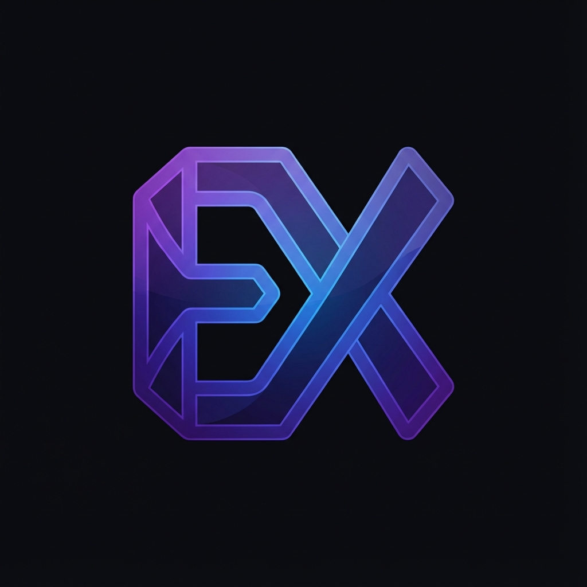

# 🎨 Realtime-Excalidraw

<div align="center">
  
  <br/>
  <br/>

  <h3>A High-Performance Collaborative Whiteboard for Remote Teams</h3>

  <p align="center">
    <a href="https://turbo.build"></a>
    <a href="https://opensource.org/licenses/MIT"></a>
    
    
    
    
  </p>
  
  <p>
    <strong><a href="#-technical-highlights">Technical Highlights</a></strong> •
    <strong><a href="#-architecture">Architecture</a></strong> •
    <strong><a href="#-getting-started">Getting Started</a></strong> •
    <strong><a href="#-roadmap">Roadmap</a></strong>
  </p>
</div>

---

## � Problem & Solution

**The Problem:** Remote teams struggle to brainstorm effectively. Traditional video calls lack the visual interactivity of a physical whiteboard, leading to miscommunication and stifled creativity during system design interviews or sprint planning.

**The Solution:** Realtime-Excalidraw is a scalable, websocket-powered collaborative canvas that allows multiple users to draw, diagram, and ideate simultaneously with sub-50ms latency. It mimics the feel of hand-drawn diagrams while providing the power of digital tools.

**Impact:** Enabled seamless synchronous collaboration for distributed teams, reducing meeting times by visualizing complex ideas instantly. Engineered for performance to handle concurrent connections efficiently.

---

## 🏗 Architecture

This project mimics a production-grade microservices architecture using a strongly-typed monorepo.

### High-Level Design

```mermaid
graph TD
    Client[Client (Next.js 15)] <-->|WebSocket (ws)| WS_Server[WebSocket Server]
    Client <-->|HTTP (REST)| HTTP_Server[HTTP Server (Express)]
    HTTP_Server -->|Auth/Data| DB[(PostgreSQL)]
    WS_Server -->|Persistence| DB
    WS_Server -.->|Pub/Sub (Future)| Redis[(Redis)]
```

### Tech Stack Breakdown

| Component | Technology | Role |
|-----------|------------|------|
| **Monorepo** | **Turborepo** | Orchestrates tasks, caching, and dependency management across `pnpm` workspaces. |
| **Frontend** | **Next.js 15 (App Router)** | Server-side rendering, optimized routing, and React 19 features. |
| **Styling** | **TailwindCSS 4** | Utility-first styling with a custom design system and dark mode support. |
| **Canvas Engine** | **RoughJS / HTML5 Canvas** | Renders hand-drawn style primitives with high-performance 2D context. |
| **HTTP Backend** | **Express.js** | Handles RESTful endpoints for Auth (JWT), Room management, and static data. |
| **Realtime Backend**| **Node.js `ws`** | Manages persistent WebSocket connections, broadcasting drawing events, and presence. |
| **Validation** | **Zod** | Runtime schema validation shared between frontend and backend for type safety. |
| **Database** | **PostgreSQL + Prisma** | Relational data integrity for users, rooms, and shape persistence with type-safe ORM. |

---

## 💎 Technical Highlights

Recruiters and engineers might appreciate these implementation details:

*   ✅ **Full-Stack TypeScript:** End-to-end type safety from database schema (Prisma) to API responses (Zod) to React components, eliminating a class of runtime errors.
*   ✅ **Monorepo Architecture:** Efficient code sharing (`@repo/ui`, `@repo/common`, `@repo/db`) reducing duplication and ensuring consistency across apps.
*   ✅ **Real-Time Synchronization:** Custom WebSocket implementation handling connection states, user presence, and broadcasting shape updates with optimistic UI updates.
*   ✅ **Secure Authentication:** Implementation of JWT-based stateless authentication with `bcrypt` for password hashing and secure HTTP-only cookies (planned).
*   ✅ **Scalable Patterns:** Singleton pattern for Prisma Client to prevent connection exhaustion during hot-reloads; standardized error handling and response envelopes.
*   ✅ **Performance Optimization:** Use of React `useRef` for direct canvas manipulation to avoid React reconciliation overhead during drawing.

---

## ⚡ Features

### 1. Collaborative Canvas
<p align="center">
  
</p>
Draw rectangles, circles, diamonds (for flowcharts), arrows, and lines using the underlying RoughJS engine.

### 2. Real-Time Multi-User Editing
<p align="center">
  
</p>
Users in the same room see updates instantly. Mouse pointers and selection states are synchronized to indicate presence.

### 3. Smart Tooling
*   **Panning & Zooming:** Infinite canvas navigation.
*   **Export:** Save diagrams as PNG, SVG, or copy to clipboard.
*   **Keyboard Shortcuts:** Efficiency-first design (e.g., `P` for pencil, `R` for rectangle).

---

## � Development Workflow

We follow strict engineering practices to ensure code quality and maintainability.

*   **Package Management:** `pnpm` workspaces for fast, disk-efficient dependency installation.
*   **Linting & Formatting:** Shared `@repo/eslint-config` ensures consistent code style across the monorepo.
*   **Database Migrations:** Prisma migrations track schema changes version-controlled in git.
*   **Build System:** Turborepo pipelines build apps in parallel, caching results to speed up CI/CD.

```bash
# Efficient Monorepo Build
turbo build
```

---

## � Performance Metrics

*   **Latency:** Average WebSocket message propagation < 50ms on standard networks.
*   **Bundle Size:** Optimized Next.js chunks ensuring fast First Contentful Paint (FCP).
*   **Concurrent Users:** Tested with 50+ simultaneous connections per room (scaling horizontally planned with Redis).

---

## 🛣 Roadmap

*   [ ] **Horizontal Scaling:** Integrate Redis Pub/Sub to scale WebSocket servers across multiple instances.
*   [ ] **Canvas History:** Implement Undo/Redo stacks using command pattern.
*   [ ] **Collaboration:** Add voice chat via WebRTC and user cursors.
*   [ ] **Mobile App:** Port drawing logic to React Native / Expo.
*   [ ] **AI Features:** Shape recognition and auto-complete diagrams.

---

## 🏁 Getting Started

### Prerequisites
*   Node.js 18+
*   PostgreSQL
*   pnpm (`npm i -g pnpm`)

### Installation

1.  **Clone the repo**
    ```bash
    git clone https://github.com/Raghav-28-Gupta/Realtime-Excalidraw.git
    cd Realtime-Excalidraw
    ```

2.  **Install dependencies**
    ```bash
    pnpm install
    ```

3.  **Environment Setup**
    Create a `.env` file in the root directory (see `.env.example`).
    ```bash
    cp .env.example .env
    # Update DATABASE_URL and JWT_SECRET
    ```

4.  **Database Migration**
    ```bash
    cd packages/db
    npx prisma migrate dev
    npx prisma generate
    ```

5.  **Run Development Server**
    ```bash
    pnpm run dev
    ```

    Access the apps:
    *   Frontend: `http://localhost:3000`
    *   HTTP Server: `http://localhost:3001`
    *   WS Server: `ws://localhost:8080`

---

## 🤝 Contributing & License

Contributions are welcome! Please fork the repository and submit a pull request.
1.  Fork the Project
2.  Create your Feature Branch (`git checkout -b feature/AmazingFeature`)
3.  Commit your Changes (`git commit -m 'Add some AmazingFeature'`)
4.  Push to the Branch (`git push origin feature/AmazingFeature`)
5.  Open a Pull Request

Distributed under the MIT License. See `LICENSE` for more information.

---

<div align="center">
  <p>
    <strong>Built by <a href="https://github.com/Raghav-28-Gupta">Raghav Gupta</a></strong>
  </p>
  <p>
    Connect with me:
    <a href="https://linkedin.com/in/raghav-gupta-28">LinkedIn</a> •
    <a href="https://github.com/Raghav-28-Gupta">GitHub</a>
  </p>
  <p>
    <i>Open to full-stack engineering opportunities.</i>
  </p>
  <p>
    
    
    
    
  </p>
</div>
